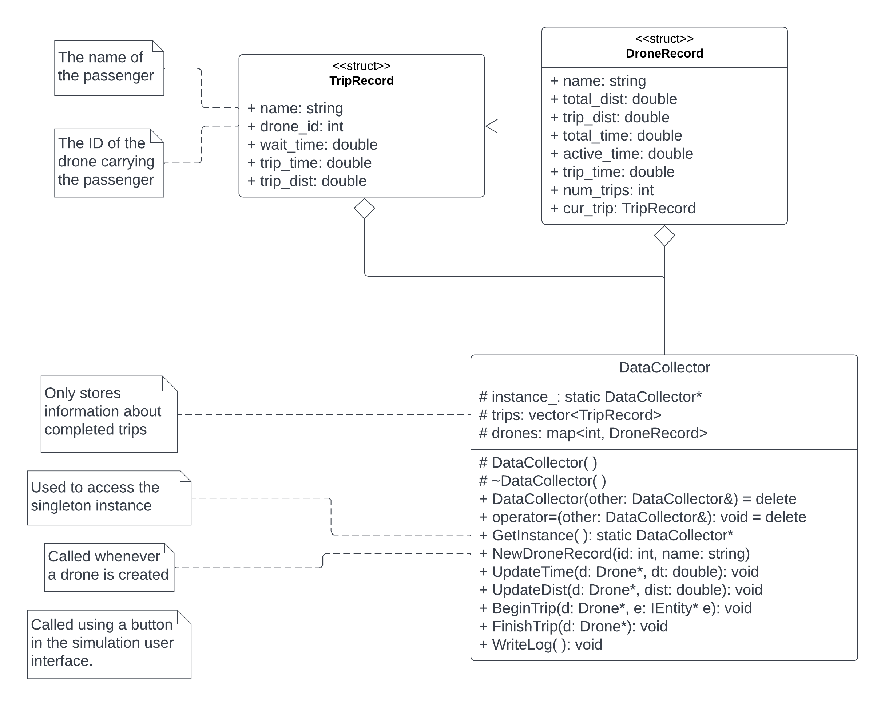

# CSCI 3081 HW4 Project Extension - Data Collection using Singleton Design Pattern
## Team Number: 010-36
  - Michael Zimmer / zimme636
  - Benjamin Chu / chu00071
  - Jefferson Enriquez-Garcia / enriq062
  - Chloe Huang / huan2055 


## Write-Up

  ### Project Overview (What is the project about?)
  - In this project, our group is extending the functionality of the Drone
  Simulation Model. The Drone Simulation Model program is an interactive program
  that simulates the behavior of drones and robots in the 3D virtual world of
  the Univeristy of Minnesota Camplus. In this world, the user can create and
  schedule trips for robots at runtime, and the drones will automatically pick
  up the robot and bring it to its destination. The user can choose from several
  routing algorithms that determines the route from pickup to the destination.

  ### How to run the Simulation
  - Running the Simulation Remotely via SSH

      1. SSH into a CSE Lab Machine using port forwarding

            ```
            In SSH bash terminal:

            ssh -L 8081:127.0.0.1:8081 x500@csel-xxxx.cselabs.umn.edu
            ```

      2. Compile the project

          ```
          In SSH bash terminal:

          cd /path/to/repo/project
          make -j
          ```
      
      3. Run project

          ```
          In SSH bash terminal:

          ./build/bin/transit_service 8081 apps/transit_service/web/
          ```
          ****NOTE** If the program crashes, a new port may need to be used.
          If so, restart from step #1 using a different port

      4. Navigate to http://127.0.0.1:8081 in your web browser to see the simulation.

      5. Navigate to http://127.0.0.1:8081/schedule.html in your web browser for 
      the interface to schedule trips.


  - Running the Simulation on a CSE lab machine

      1. Compile the project

          ```
          In bash terminal:

          cd /path/to/repo/project
          make -j
          ```
      
      2. Run project

          ```
          In bash terminal:

          ./build/bin/transit_service 8081 apps/transit_service/web/
          ```
          ****NOTE** If the program crashes, a new port may need to be used.
          If so, choose a different port.

      3. Navigate to http://127.0.0.1:8081 in your web browser to see the simulation.

      4. Navigate to http://127.0.0.1:8081/schedule.html in your web browser for 
      the interface to schedule trips.

  ### What does the simulation do?
  - The Drone Simulation Model program is an interactive program that simulates
  the behavior of drones and robots in the 3D virtual world of the Univeristy of
  Minnesota Campus. In this world, the user can create and schedule trips for
  robots at runtime, and drones will automatically pick up the robot and bring
  it to its destination. The user can choose from several routing algorithms
  that determines the route from pickup to the destination.


  ## New Feature - Data Collector

  ### DataCollector UML Class Diagram


  ### What does it do?
  - We extended the functionality of the Drone Simulation Model to automatically
  collect and save data from the simulation as a JSON file to disk.
  - The following data is collected for each completed trip:
    1. Robot passenger name
    2. ID of the drone carrying the passenger
    3. Time spent waiting for drone to approach
    4. Trip time
    5. Trip distance
  - The following data is collected for each drone:
    1. Drone ID
    2. Drone name
    3. Total distance travelled
    4. Total distance travelled with a robot passenger
    5. Total time
    6. Total time travelled
    7. Total time travelled with a robot passenger
    8. Number of trips completed
  - The following data is also collected:
    1. Number of trips
    2. Average wait time
    3. Minimum wait time
    4. Maximum wait time
    5. Number of drones
    6. Fraction of drone time spent active

  ### Why is it significantly interesting?
  - In a world of Uber, Lyft, Prime Delivery, Fedex, it critical for management
  to analyze trends, identify operational inefficiencies, and improve customer
  satisfaction. In order to do these things effectively, vast amounts of
  accurate and relevant data must be collected. While the Drone Simulation Model
  has no effect on the real world, our Data Collector feature is exactly the
  type of functionality that could be implemented in real world systems for
  Uber, Prime Delivery, etc.

  ### How does it add to the existing work?
  - The Data Collection feature will add to existing work by utilizing the
  existing functionality of the SimulationModel and Drone classes. The data we
  are collecting is already being generated prior to our extension, but there is
  no existing mechanism to accumulate and save this data.

  ### Our design pattern
  - Our design pattern is the Singleton design pattern. The Singleton pattern is
  an ideal choice for the Data Collector feature as we want all data produced by
  the simulation model to be captured in a data structure that can be used
  globally. However, the Singleton pattern prevents accidentally capturing in
  more than one object, which could produce inaccurate or incomplete data logs.

  ### Instructions to use our feature. Not user interactable
  - Data is automatically saved by the Data Collector feature without user
  interaction.
  - Data from each simulation session is saved as a JSON file to the "logs"
  directory in the project's root directory by clicking "Write Log" button in
  the Schedule user interface.

  ### Data Analysis
  We tested our simulation with 10 trips for 10, 20, and 30 drones, placed
  randomly. Here were our results:
  - 10 Drones:
    - Average wait time: 22.452
    - Minimum wait time: 3.45
    - Maximum wait time: 64.4763
    - Drone activity ratio: 0.622849
  - 20 Drones:
    - Average wait time: 18.2271
    - Minimum wait time: 5.23
    - Maximum wait time: 46.0415
    - Drone activity ratio: 0.306898
  - 30 Drones:
    - Average wait time: 16.0302
    - Minimum wait time: 2.44
    - Maximum wait time: 40.9773
    - Drone activity ratio: 0.233363

  From these results, we can see that as the number of drones increases, wait
  times decrease for passengers, but the drones spend more time idle.

## Spring Retrospective
- What went well
  1. Our design for the Data Collector feature was well thought out early in the sprint.
- What to improve
  1. Better assignment of responsibilities / better utilization of Jira.
  2. Create a branching strategy for the project and new feature to prevent merge conflict issues.

## Links
- DockerHub link: https://hub.docker.com/repository/docker/zimme636/hw4
