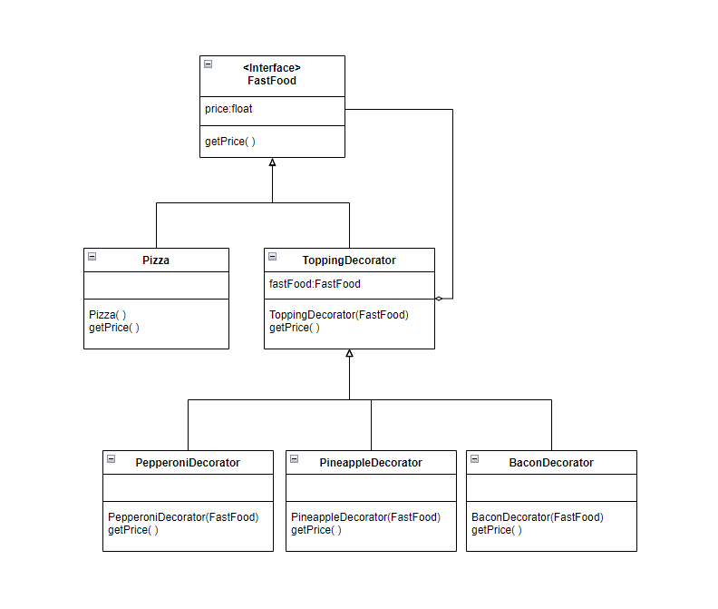

# 3081 Lab09 - Decorator Design Pattern
_(Due: Thursday, Nov. 10, 2022 @ 11:59pm)_

## General Information

### Accesing a Lab Machine

For this assignment, we suggest you use a lab machine in ***Keller Hall 1-250*** or ***Keller Hall 1-262*** ([details](https://cse.umn.edu/cseit/classrooms-labs#cselabs)). You can access a lab machine remotely using [VOLE](https://github.umn.edu/umn-csci-3081-F22/shared-upstream/tree/main/FAQs/VOLE), FASTX, and [SSH](https://github.umn.edu/umn-csci-3081-F22/shared-upstream/tree/main/FAQs/SSH). If you do not already have a CSE account, create the account following these [instructions](https://wwws.cs.umn.edu/account-management).

If you are using FASTX, you can access the machine by going to the webpage https://csel-kh1250-XX.cselabs.umn.edu where XX is the machine identifier number, and `kh1250` represents the machine is in the Keller 1-250 lab. In Keller 1-250, the machine numbers are 01-37, and in Keller 1-262 the machine numbers are 01-28. Please do not use the machine in the example below, choose a different one so the entire class isn't trying to work off of the same computer. For example, if you choose to use machine 09 in Keller 1-250, you should type into your web browser [https://csel-kh1250-09.cselabs.umn.edu](https://csel-kh1250-09.cselabs.umn.edu) to connect to your machine. Use your CSE account to login to the machine. One you login, click the + icon in the top left to create a new session, then choose XFCE and click Launch.

If you are using SSH, you will use the same hostnames as described in how to connect with FASTX. For example, if you'd like to connect to machine 09 in Keller 1-250, you will do `ssh X500@csel-kh1250-09.cselabs.umn.edu`, where `X500` is your x500 ID that is registered as a CSE Labs account.

**IMPORTANT: Inside the lab machine, only files saved to your home folder (e.g., `/home/kaung006`) will be persisted across sessions. If you log out, make sure your progress is pushed to GitHub or saved in the home folder.**

### Diskquota Exceed
One of the reasons you might not be able to log into a lab machine is that you reached your CSE Labs Account disk quota. <br>
To free up space, [see here](https://github.umn.edu/umn-csci-3081-F22/shared-upstream/tree/main/FAQs/CSE%20Disk%20Quota%20Exceeds)

## Retrieve Class Materials

1. Clone **public lab09** repo
    ```bash
    git clone git@github.umn.edu:umn-csci-3081-F22/public-lab09.git
    ```

2. Clone your **private lab09** repo<br>
    *Note: **replace** Team-XXX-X with your lecture section and team number* <br>
    *Example: Team-001-1-lab09*
    ```bash
    git clone git@github.umn.edu:umn-csci-3081-F22/Team-XXX-X-lab09.git
    ```

3. Copy the contents of **public lab09** repo into your **private lab09** repo and you can start working inside your private repo.

## Lab Instructions

### Goal
<hr>
  **The primary goal of this lab is for you to implement the entity's celebration once they get to their destination using decorator design pattern that you learn during the lecture into actual code.**
<hr>

## Tasks
| ID | Title | Task Summary Description | Task Deliverable |
| :---: | --- | --- | --- |
| Task 1 | Decorator Design Pattern | Create decorator classes | Source Code |
| Task 2 | Decorator Design Pattern | Implement the usecase for decorators | Source Code |
| Task 3 | Doxygen | Create documentation of the classes/functions that you create | HTML |
| Task 4 | Code Styling | Match your code style with Google style guidlines | Source Code |

## Demo
You can view the demo of the final result [here](https://github.umn.edu/umn-csci-3081-F22/shared-upstream/blob/main/Demos/Lab09/README.md).

### Task 1 (Create Decorator Classes)
### The Decorator Pattern

The Decorator Pattern is used for adding more behaviors/functionality to an object at runtime.

<p align="center"> </p>

A great example of the decorator pattern is a pizza toppings. In this analogy the pizza base is first created and the toppings were added later onto it. Everytime the toppings were added, the price of the pizza increases depending on the toppings. The toppings can add not only to the pizza but also other type of food if it exists as well.

## Drone and Robot celebration decorator pattern

<p align="center"> </p>

*Note: This UML is the addition of the UML that we used for Strategy Pattern*<br>

The entities will celebrate once they get to their destination by spinning and/or jumping around. We will implement this by using decorator pattern. For this lab, we will only have spinning and jumping around as celebration, however you can be creative and add more additional celebration style as you wish (just let the TA know that you are implementing additional celebration style once you submit).

Steps:
1. Now you will be implementing the **Decorator Design pattern** that you seen above. The functions and variable does not need to be the exact same, this is just one way to implement. But the UML graph relation of your solution must be the same.
2. Create CelebrationDecorator class, SpinDecorator class, and JumpDecorator class. 
    - Variables
        - strategy: The IStrategy that we want to add current decorator onto
        - time: time count check how long has the celebration has occurred
    - Functions
        - Constructor( ): set the time to 0
        - Move( ): Check if previous strategy has completed, if so, do current strategy movement (i.e., spin and/or jump)
            - Note: Make sure spinning or jumping looks good and not too fast or too slow
        - IsCompleted( ): Check if current strategy has completed. Current strategy will complete only if the time has lived for 1.5 sec

### Task 2 (Use the decorators)
Steps:
1. Use the created decorators inside drone.cc as follow.
    - Astar : only spin decorator
    - DFS : only jump decorator
    - Dijkstra : spin first and then jump

**Note**: After the drone and robot has reached to their destination, both of these entities should celebrate.

**Hint**: *Use the UML diagram provided for strategy design pattern to get started.*

After you completed implementing the decorator design pattern, once the entities reached to their destination, they will celebrate according to the movement strategy pattern.

### Task 3 (Doxygen)
Write Doxygen for all the **NEW** classes you create (public members only). Which in our case for this lab, are as follows:
- CelebrationDecorator
- SpinDecorator
- JumpDecorator

### Task 4 (Code Style)
Match your new code's style with Google Code Styling guide. Which in our case for this lab, is as follow:
- CelebrationDecorator
- SpinDecorator
- JumpDecorator

### Final Submission

To submit your assignment, post on the Gradescope assignment "Lab 9: Decorator Design Pattern" your team repo link and the final commit ID for your submission.
[Click here](https://github.umn.edu/umn-csci-3081-F22/shared-upstream/tree/main/FAQs/Commit%20ID) to see how to obtain commit ID.
